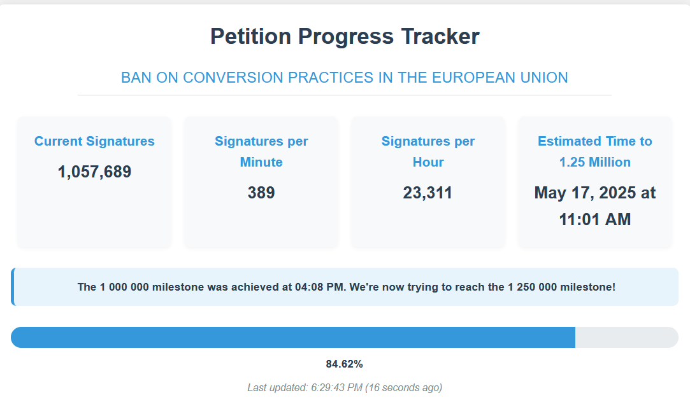
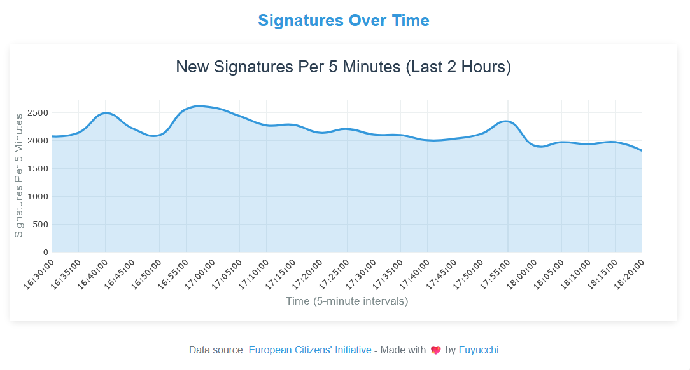
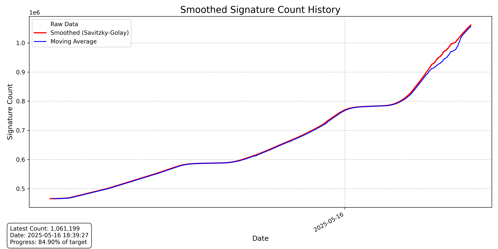
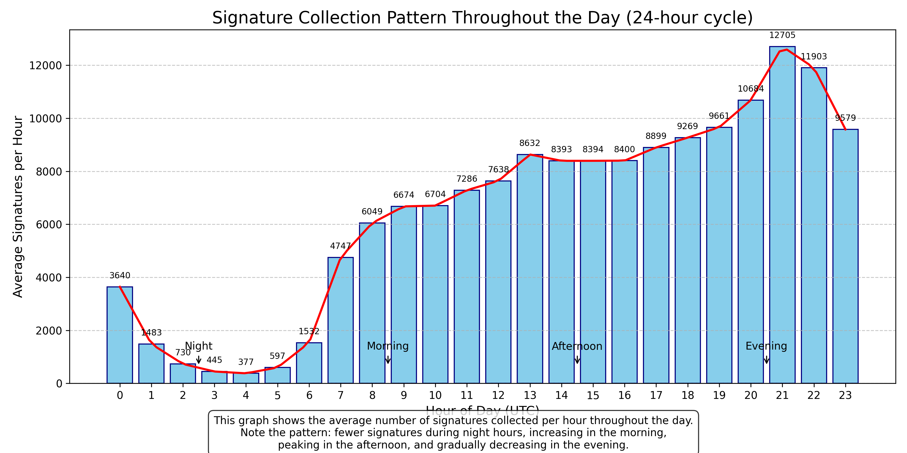

# Petition Counter - European Citizens' Initiative Tracker

A real-time web application that tracks and predicts signature counts for the European Citizens' Initiative (ECI) petition "Ban on conversion practices in the European Union".



## Table of Contents
- [Description](#description)
- [Features](#features)
- [Fast data exploration](#fast-data-exploration)
- [Things I tried to make the prediction work](#things-i-tried-to-make-the-prediction-work)
- [Installation](#installation)
- [Usage](#usage)
- [Dependencies](#dependencies)
- [License](#license)
- [Acknowledgments](#acknowledgments)

## Description

This application fetches signature data from the European Citizens' Initiative website, tracks the progress toward the target of 1.25 million signatures, and provides predictions on when this target will be reached. It uses time-of-day based models to account for variations in signature rates throughout the day.

The application includes:
- Real-time signature count tracking
- Signature rate calculations (per minute, per hour)
- Time-of-day based prediction models
- Data visualization of signature history


## Features

- **Live Signature Tracking**: Automatically fetches the current signature count from the ECI website
- **Real-time Statistics**: Displays signatures per minute and per hour
- **Prediction Model**: Estimates when the petition will reach its target of 1.25 million signatures
- **Interactive Visualization**: Shows signature history and trends over time

## Fast data exploration

Building this project was a great opportunity to explore the data and understand the patterns. Those helped me refine the prediction model.

- **Smoothed Visualization**: Smoothed view of signature history for trend analysis


- **24-Hour Pattern Analysis**: How many signatures are collected throughout the day

## Things I tried to make the prediction work

- **Time-of-Day Based Inference**: Implemented an inference that consider the time of day for more accurate predictions. Keeps track of the average signature count per hour and use it to predict future counts.
- **Polynomial Regression**: Explored polynomial regression models for prediction (not very effective)
- **Linear Regression**: Used linear regression for basic prediction (so, so wrong.)
- **Fourier Transform**: Analyzed the signature data using Fourier transforms to identify patterns (not very effective)
- **Three Windows Fourier Transform**: Implemented a three-window Fourier transform for more complex pattern recognition (not very effective)
- **Stepwise Linear Regression**: Used stepwise linear regression to identify significant predictors (worked well!)

## Installation

1. Clone the repository:
```
git clone https://github.com/Fuyucch1/CountinPrediction.git
cd CountinPrediction
```

2. Create and activate a virtual environment (recommended):
```
python -m venv .venv
.venv\Scripts\activate
```

3. Install the required dependencies:
```
pip install -r requirements.txt
```

4. Install Playwright browsers:
```
playwright install
```

## Usage

1. Start the Flask application:
```
python app.py
```

2. Open a web browser and navigate to:
```
http://localhost:5000
```

## Dependencies

- Flask: Web application framework
- Playwright: Web scraping for signature counts
- NumPy: Numerical operations
- Matplotlib: Data visualization
- scikit-learn: Machine learning for prediction models
- SciPy: Scientific computing and curve fitting

## License

This project is open source and available under the [MIT License](LICENSE).

## Acknowledgments

- European Citizens' Initiative for providing the petition platform
